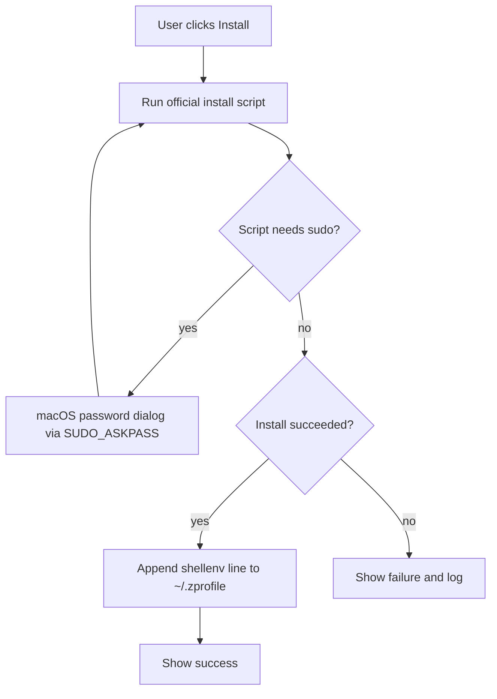

# Homebrew Installer

A small macOS app that installs Homebrew for users who do not use the Terminal.

## What the app does

1. The app runs the official Homebrew install script:
   `/bin/bash -c "$(curl -fsSL https://raw.githubusercontent.com/Homebrew/install/HEAD/install.sh)"`
2. The app sets `NONINTERACTIVE=1`. This removes the "press Enter" prompt.
3. The app sets `SUDO_ASKPASS` to a bundled helper script. When the install
   script needs `sudo`, macOS shows a native password dialog instead of a
   terminal prompt.
4. After a successful install, the app appends this line to `~/.zprofile`
   if the line is not already present:
   `eval "$(/opt/homebrew/bin/brew shellenv)"`
   On an Intel Mac, the path is `/usr/local/bin/brew`.



## Download

- Download the newest `Homebrew-Installer.zip` from the
  [Releases page](https://github.com/gstark/homebrew-easy-install/releases).
- Unzip the file.
- Double-click the app. If macOS blocks the app, the build is not
  notarized; right-click the app and select Open instead.

## Requirements

- macOS 13 or newer, Apple Silicon.
- An administrator account. The user must know their login password.
- A network connection.

## Build

You must have the Xcode Command Line Tools.

```
./build.sh
```

The result is `build/Homebrew Installer.app`.

## Distribution note

CI signs and notarizes release builds with a Developer ID certificate when
the signing secrets are configured. See `SIGNING.md` for the setup. A local
`./build.sh` without `CODESIGN_IDENTITY` produces an ad-hoc signed build;
Gatekeeper blocks such a build if it comes from the internet, and the
recipient must right-click the app and select Open.

## Files

- `Sources/main.swift` — the SwiftUI app.
- `Resources/askpass.sh` — the GUI password helper for `sudo -A`.
- `Resources/Info.plist` — the bundle metadata.
- `build.sh` — the build script.
